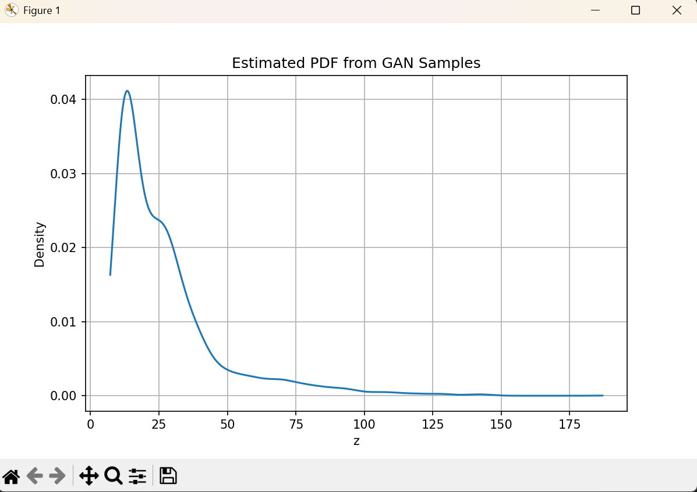
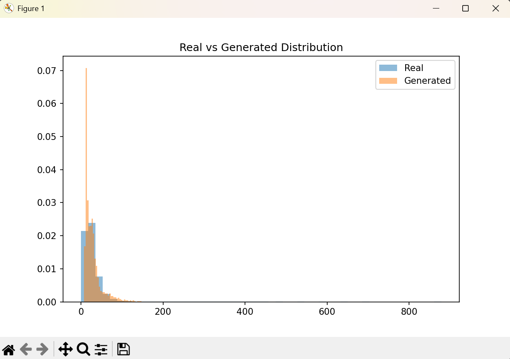
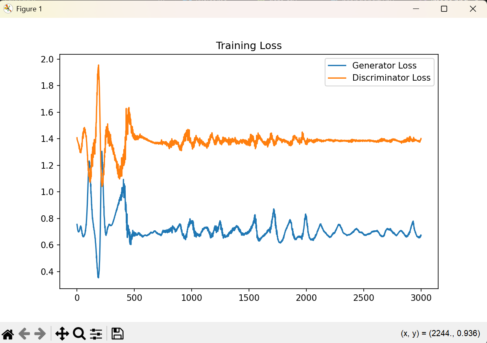

# Learning Probability Density Function using GAN

## Objective

The objective of this assignment is to learn an **unknown probability density function (PDF)** of a transformed random variable using a **Generative Adversarial Network (GAN)** without assuming any analytical distribution.

The GAN learns the distribution only from sample data.

---

## Dataset

Dataset used: **India Air Quality Data**

Feature selected: **NO₂ concentration (x)**

The transformed variable is computed from NO₂ values.

---

## Transformation Function

Each value of (x) is transformed into (z) using:

[
z = x + a_r \sin(b_r x)
]

Where:

* Roll Number = **102303144**
* (a_r = 0.5 (r \bmod 7) = 3.0)
* (b_r = 0.3 ((r \bmod 5)+1) = 1.5)

Final transformation:

[
z = x + 3 \sin(1.5x)
]

---

## Methodology

The project follows three main steps:

### Step 1 — Data Transformation

1. Extract NO₂ values from dataset.
2. Apply transformation function to obtain samples of variable (z).

---

### Step 2 — GAN Training (Core Task)

A Generative Adversarial Network is designed to learn the unknown distribution of (z).

The GAN consists of:

#### Generator

* Input: Random noise sampled from (N(0,1))
* Architecture:

  * Linear(5 → 32)
  * ReLU
  * Linear(32 → 32)
  * ReLU
  * Linear(32 → 1)

Output: Generated sample (z_f)

#### Discriminator

* Input: Real or generated (z)
* Architecture:

  * Linear(1 → 32)
  * ReLU
  * Linear(32 → 32)
  * ReLU
  * Linear(32 → 1)
  * Sigmoid

Output: Probability of sample being real.

The discriminator learns to distinguish:

* Real samples → (z)
* Fake samples → (z_f = G(\epsilon))

---

### Step 3 — PDF Approximation

After training:

1. A large number of samples are generated from the generator.
2. Kernel Density Estimation (KDE) is used to approximate the probability density function.

---

## Results

### 1. Estimated PDF from GAN Samples




---

### 2️⃣ Real vs Generated Distribution Comparison




---

### 3️⃣ Training Loss Curve




---

## Observations

### Mode Coverage

The GAN successfully captured the major modes of the transformed distribution. The generated samples show good overlap with real samples, indicating effective learning of the underlying distribution.

### Training Stability

The loss curves exhibit oscillatory behavior typical of GAN training. However, the losses remain bounded, indicating stable adversarial learning between generator and discriminator.

### Quality of Generated Distribution

The KDE-based estimated PDF closely matches the empirical distribution obtained from real data. This demonstrates that the generator successfully learned the unknown density without assuming any parametric form.

---

## Key Learning Outcomes

* Understanding GANs for **density estimation**
* Learning **implicit probability modeling**
* Working with **real-world environmental data**
* Observing GAN training dynamics

---

## How to Run

1. Install dependencies:

```
pip install pandas numpy matplotlib scipy torch
```

2. Place dataset file:

```
data.csv
```

3. Run:

```
python probdensity.py
```

---

## Project Structure

```
ProbabilityDensity/
│── probdensity.py
│── data.csv
│── README.md
│
└── images/
    ├── estimatedpdf.png
    ├── realvsgenerated.png
    └── trainingloss.png
```

---

## Conclusion

This project demonstrates that Generative Adversarial Networks can successfully learn an unknown probability density function purely from data samples without assuming any analytical distribution. The generator implicitly models the distribution, and KDE estimation confirms the quality of learned density.

---

## Author

Name: **Arshia Anand**
Roll Number: **102303144**
